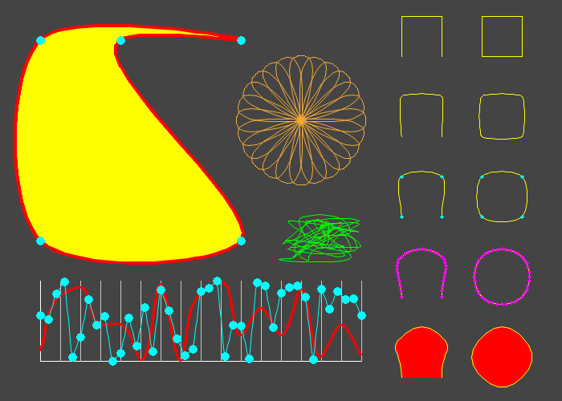

# 🦎 salamander-GD Catmull-Rom Spline Drawing Library

Using this library you can draw Catmull-Rom splines using the GD image library extension in PHP. Catmull-Rom splines can be used to draw a wide range of simple and complex shapes not available by default with GD.

The **salamander-GD** drop-in libraries are designed to be as simple as possible to integrate into your code and do not include any auto-loading schemes that may conflict with your existing applications, and all classes are namespaced.

This set of libraries has been named in honor of one of nature's most intriguing and remarkable species, the salamander. To find out more about salamanders and support their conservation please visit the [Foundation for the Conservation of Salamanders](https://www.fcsal.org/) web site.

## System requirements

- PHP 5.4+ with GD extension

## Example

The following script can be used to generate the example image shown below:

- `example-catmullrom-spline.php`
  - Browser-based script to generate and display the example image in your browser

Please see the comments at the top of this script for more details on how to run it.



## How to use

In your scripts, import the library like this:

```php
require_once('salamander-gd.helper.php');
require_once('salamander-gd.vertex.php');
require_once('salamander-gd.catmullrom.php');
```

Create your GD image object and then instantiate the spline drawing object as follows, using `$closed=true` for closed splines or `$closed=false` for open splines:

```php
$spline = new \SalamanderGD\CatmullRomSpline($closed=false);
```

Now add points to the spline (minimum 3 points required):

```php
$spline->addPoint(100, 100);
$spline->addPoint(125, 50);
$spline->addPoint(150, 100);
$spline->addPoint(175, 50);
```

Apply a stroke width and color to the spline:

```php
$spline->setStrokeColor('#FFFF00');
$spline->setStrokeWidth(1);
```

You can also apply a background fill color to the spline like this:

```php
$spline->setBackgroundColor('#FF0000');
```

You can specify colors either as hex values or as GD color value arrays:

```php
$spline->setBackgroundColor('#FF0000');
// equivalent to
$spline->setBackgroundColor([255, 0, 0]);
```

Then draw the spline on to your GD image canvas:

```php
$spline->draw($image);
```

The library also includes functions to draw the control points and interpolation points that make up the spline, which can be useful for drawing dotted lines if no stroke or background color is applied:

```php
$spline->showControlPoints('#00FFFF', $radius=10);
$spline->showInterpolationPoints('#FF00FF', $radius=5);
```

You can also rotate splines around a fixed point like this:

```php
$spline->rotate($x=150, $y=75, $angle=45);
```

### GD issues

Anti-aliasing may not be available in some PHP installations < 7.1 because the `imageantialias()` function is only available if PHP has been compiled with the bundled version of the GD library.

## PHP version compatibility
- Development PHP version: PHP 7.4.33 with GD extension
- Minimum PHP version tested: PHP 5.4.45 with GD extension
- Maximum PHP version tested: PHP 8.2.0 with GD extension

The **salamander-GD** libraries have been written to be compatible with as many versions of PHP as possible. If you are not able to run this code on your version of PHP please raise an issue on GitHub, specifying your exact PHP version, and what error messages (if any) you receive.

## Support This Software

If you would like to contribute to the ongoing development of this software and other drawing libraries please [make a donation](https://www.paypal.com/donate/?hosted_button_id=YG3ZJSUM7RUZJ)! Donations are greatly appreciated and will allow me to spend more time updating and enhancing the software. Thank you :)

## Contact

If you have any questions about the code or suggestions to improve it please submit an issue or create a new topic in the Discussions section. You can also email me here: [info@camogen-php.com](mailto:info@camogen-php.com)
